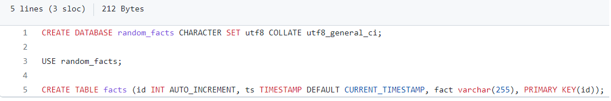
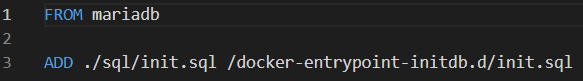
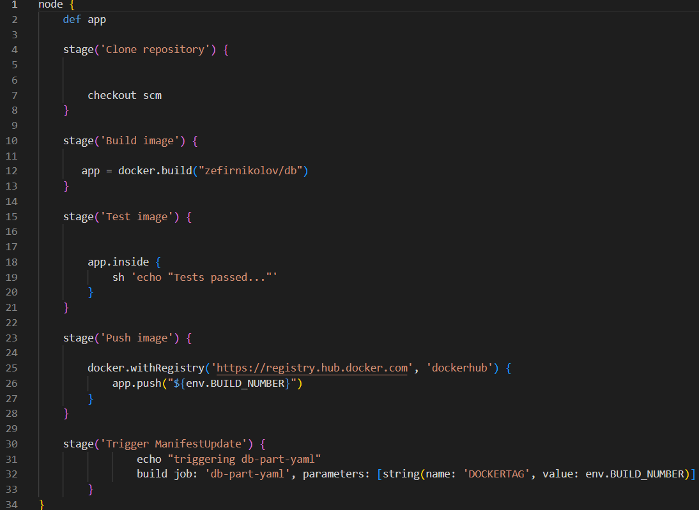

# https://app.zefirnikolov.com

this is the **database** part **microservice** of the whole **Kubernetes Cluster** deployed on **Amazon Web Services – AWS**. 
This part is intended for development team + **Dockerfile** and **Jenkinsfile** are intended for the **DevOps** -> Please see the whole cluster on **https://github.com/zefirnikolov/awsapp-k8scluster**

Code folder consists only 1 file: the mysql init file ->  It creates a database called **random_facts** and after that creates table **facts** in which is stored the sent randomly generated text from the **generator microservice**. -> This file is used for the Docker Image to be uploaded in the Mysql folder of the MariaDB docker Image.

The **Dockerfile**:
Downloads the official **MariaDB** image, then it only adds the code from the init file to the init file of the **MariaDB** database system.

The **Jenkinsfile**:
Clones the **git repository** -> creates a **docker image** from the **Dockerfile** -> Push the image with **Updated TAG** to **Docker Hub** -> triggers the **second Jenkins job responsible** for the cluster repository.

The Jenkins job is with configured webhook - any time a change is made from this repository - It automatically builds this job using the Jenkinsfile.
